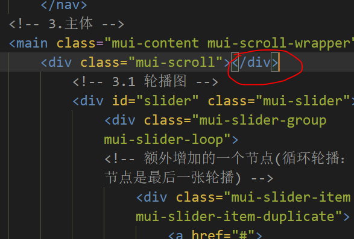
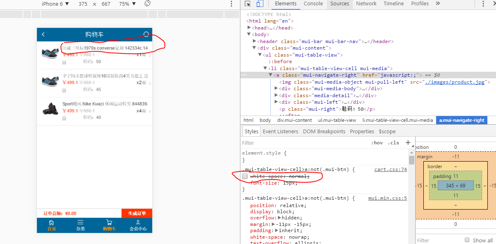
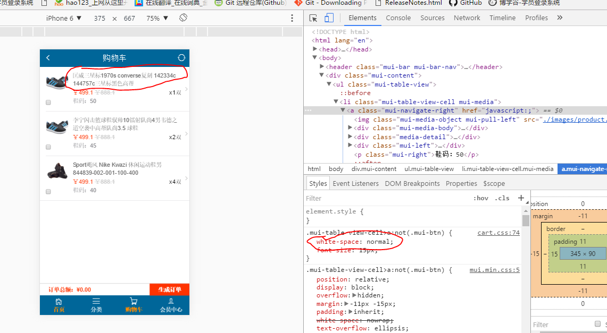

#### 第一天

1. 首页区域滚动问题

   问题：如下图

   

   解决：1.div后面直接闭合了，应该在内容最后闭合的

   ​	    2.区域回弹需要有一定的高度，如果页面不高，没有滚动条，可以尝试加margin-bottom

   ​	    3.分类页同样出现不能回弹问题，js回弹类名选择器错误，将scroll写成srcoll，和html不一致

2. 多个页面都有的商品介绍，因为字数较多，想实现自动换行

   

   解决：要给父盒子添加宽度及white-space: normal;

   

   ### 第二天

   ​

